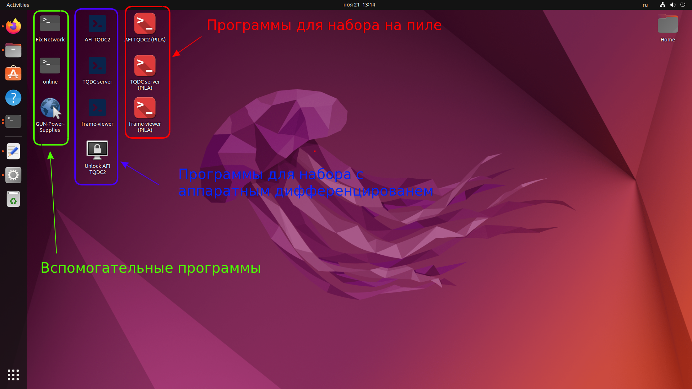
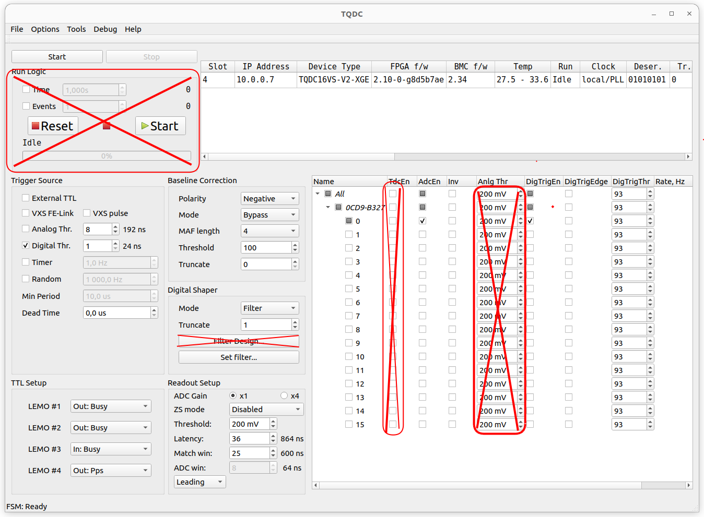
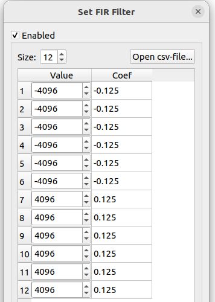
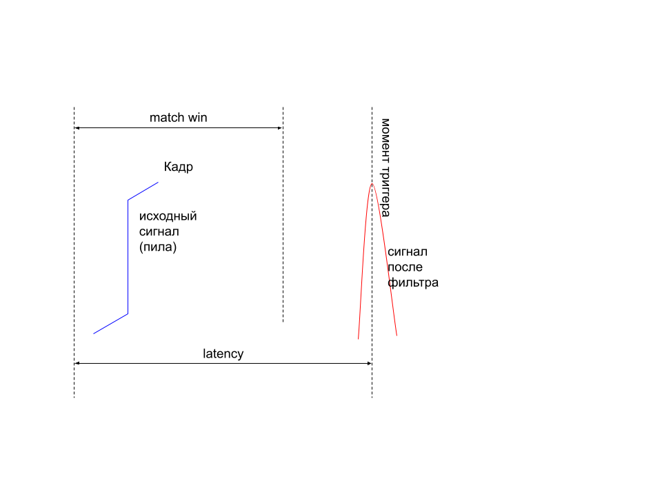
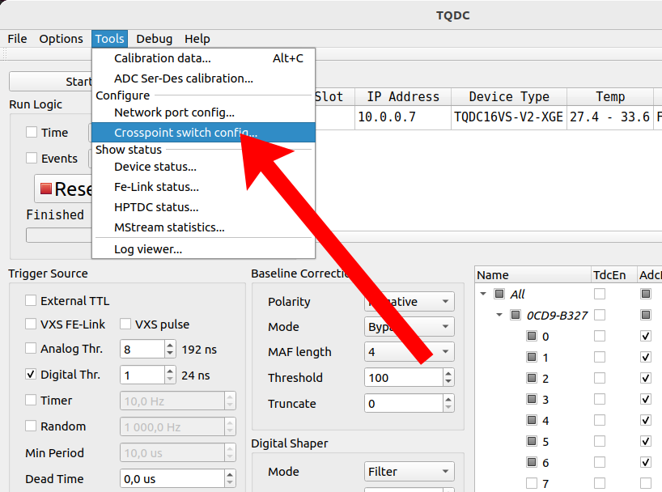
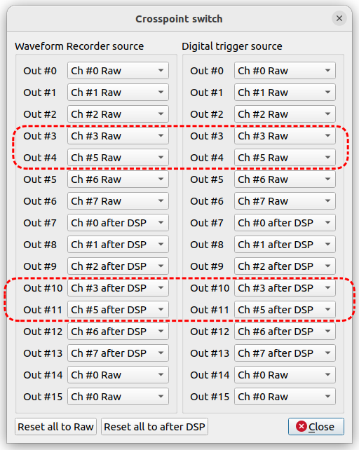

На модуле детектора доступны 3 платы (пронумерованы)
- плата 1 - старое железо, старая прошивка. На ней мы набирали последние 2 сеанса
- плата 2 - старое железо, новая прошивка
- плата 3 - новое железо, новая прошивка

2 и 3 платы вроде одинаковые. Программы под новые платы по-умолчанию настроены на плату 3.

## Иконки на рабочем столе

- Старый режим набора (не будет использоваться на сеансе):
  - **AFI TQDC2** - приложение для настройки параметров набора платы 1
  - **frame-viewer** - визуализация кадров в реальном времени для платы 1
  - **TQDC server** - модуль для набора с помощью online для платы 1
  - **Unlock AFI TQDC2** - разблокировать интерфейс AFI TQDC2
  
- Новый режим набора:
  - **AFI TQDC2 (PILA)** - приложение для настройки параметров набора платы 3
  - **frame-viewer (PILA)** - визуализация кадров в реальном времени для платы 3. В нынешнем варианте программа отображает кадры как они идут с платы (в виде пилы), не корректируя базовую линию и не сдвигаясь на 2 бита.
  - **TQDC server (PILA)** - модуль для набора с помощью online для платы 3
  - **TQDC server NO ZS (PILA)** - модуль для набора с помощью online для платы 3 без zero-suppression
  
- Вспомогательные:
  - **Fix Network** - сбросить параметры сети. Используется, если программа AFI TQDC2 перестает видеть платы (пароль: **Neutrino**)
  - **online** - локальная программа набора online. Используется для тестирования на месте.
  - **GUN-Power-Supplies** - программа для настройки питания пушки.

## Настройка набора на пиле
1. Выключить **TQDC server (PILA)**, если он запущен.
2. Запустить **AFI TQDC2 (PILA)** (если уже работает, то можно не перезапускать). Убедиться что плата подключилась (в таблице устройств должен показываться IP адрес платы).
    
3. Настроить нужные параметры
   - Окошко **Trigger Source**:
      параметры окна должны быть выставлены как на скриншоте.

      *Для тестирования можно включить режимы **Timer** (генерация тригера с заданной частотой) и **Random** (генерация случайного триггера с заданной частотой).*

      <!-- мы используем только цифровой триггер, поэтому галочка должна стоять только на нем, а значение справа должно быть **1**. 
      **Dead Time** должно равняться **0** т.к. мы его не используем -->
    - Окошко **TTL Setup** должно быть настроено как на скриншоте (не трогаем).
    - Окошко **Baseline Correction** должно быть настроено как на скриншоте (режим Bypass).
    - 
      <!--  -->

      Окошко **Digital Shaper**: Кнопка **Set filter...** позволяет задать форму фильтра. Левая колонка в новом окне задает значение веса конкретной точки фильтра во внутренних единицах (-32768 соответвует -1.0, 32768 соответвует 1.0). В правой колонке отображены эти же коэффициенты, пересчитанные в относительные единицы.
      Остальные параметры должны быть выставлены как на скриншоте.
    - Окошко **Readout Setup**: здесь мы меняем только **Latency** и **Match win**, остальные параметры должны быть выставлены как на скриншоте.

      Схема работы этих параметров показана на рисунке ниже: 
      
      <!-- исходник: https://docs.google.com/drawings/d/1LIHkcRD4VATDGaXxY3KM4l2Zi0tEgRWI9maTayy1yn4/edit?usp=sharing -->
      Справа от обоих параметров отображается их значение в наносекундах.

    - Таблица каналов:
      Карта каналов задается через таблицу **Crosspoint switch config...**, но лучше ее не трогать (если выставить для одного выхода разные значения правой и левой колонок, то конфигурация не сохранится и будет сброшена при перезапуске программы).
      |                          |                                |
      :-------------------------:|:-------------------------:
        |  

      > **_NOTE:_**  Мы пропускаем физический канал #5. Поэтому в **Crosspoint switch** после выхода #3 карта каналов сдвинута на 1.

      По-умолчанию (при параметрах как на скриншоте):

      Каналы 0..6 соответсвуют 1..7 до обработки фильтром. Для набора точки должны быть включены только они.

      Каналы 7..13 соответсвуют 1..7 после обработки фильтром. Их можно включить для тестирования вместе с frame-viewer чтобы посмотреть что выдает фильтр.

      - столбец **TdcEn** должен быть отключен у всех каналов
      - задать в столбце **AdcEn** каналы, которые будут записаны.
      - столбец **Anlg Thr** не используется
      - задать в столбце **DigTrigEn** каналы, используемые для триггера. Т.к. мы привязываемся к триггеру после фильтра, должны использоваться каналы 7..13 (7-й соответвует 1-му, 8-й - 2-му и т.д.).
      - задать в столбце **DigTrigThr** пороги для тригеров (то же самое, используем 7..13 каналы).

    **!!! Во время набора размер кадра должен быть не меньше 600 нс и все 7 каналов должны быть включены, в противном случае скорость счета не будет стабильной !!!**

4. Проверить, что все задано как надо. Для этого можно запусить программу **frame-viewer (PILA)** и стартануть набор (серая кнопка **Start**). Если все настроено правильно, то в окне **frame-viewer** должны появляться кадры. После проверки остановить набор (кнопка **Stop**) и закрыть окно **frame-viewer**. Порядок включения/выключения важен.
5. Запустить **TQDC server (PILA)**. Проверить что порог и фильтр заданы правильно (первые 2 строки в терминале). Если все хорошо - можно начинать набор.
    
    *Порог zero-suppression выставляется как самый минимальный из включенных в **AFI TQDC2 (PILA)** каналах*

## Возможные проблемы
1. **AFI TQDC2 (PILA)** не видит плату:

    решение: запустить **Fix Network** (пароль: **Neutrino**). Если не помогает - перезагрузить плату (выключить и включить питание) и попробовать снова, перезагрузить компьютер.

2. Параметры **latency** и **match win** не задаются правильно:
    решение: перезапустить **AFI TQDC2 (PILA)**
